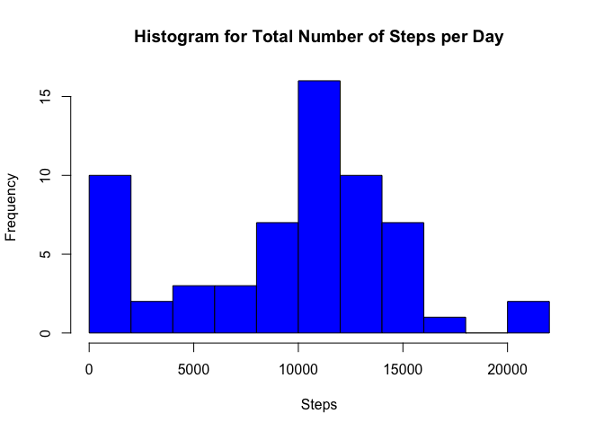
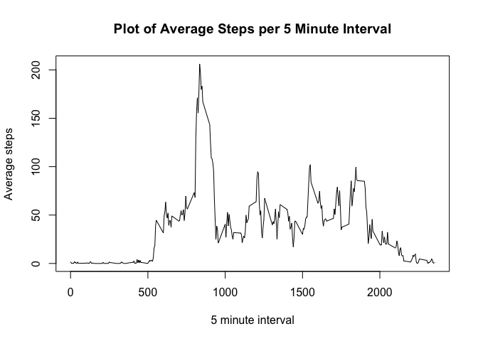
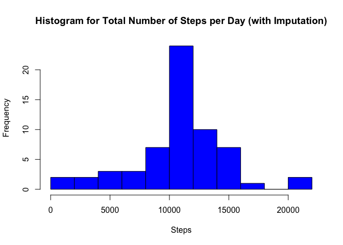
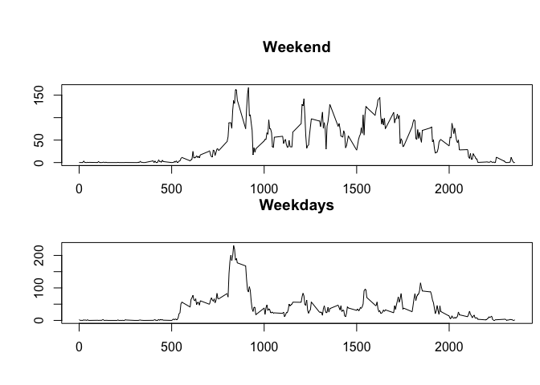

## Loading and preprocessing the data

First, we can read in the .csv file containing the activity data. We'll print out the first and last few rows of it and run a quick summary to explore the contents.


```r
activityData <- read.csv("./activity.csv")
head(activityData)
```

```
##   steps       date interval
## 1    NA 2012-10-01        0
## 2    NA 2012-10-01        5
## 3    NA 2012-10-01       10
## 4    NA 2012-10-01       15
## 5    NA 2012-10-01       20
## 6    NA 2012-10-01       25
```

```r
tail(activityData)
```

```
##       steps       date interval
## 17563    NA 2012-11-30     2330
## 17564    NA 2012-11-30     2335
## 17565    NA 2012-11-30     2340
## 17566    NA 2012-11-30     2345
## 17567    NA 2012-11-30     2350
## 17568    NA 2012-11-30     2355
```

```r
summary(activityData)
```

```
##      steps                date          interval     
##  Min.   :  0.00   2012-10-01:  288   Min.   :   0.0  
##  1st Qu.:  0.00   2012-10-02:  288   1st Qu.: 588.8  
##  Median :  0.00   2012-10-03:  288   Median :1177.5  
##  Mean   : 37.38   2012-10-04:  288   Mean   :1177.5  
##  3rd Qu.: 12.00   2012-10-05:  288   3rd Qu.:1766.2  
##  Max.   :806.00   2012-10-06:  288   Max.   :2355.0  
##  NA's   :2304     (Other)   :15840
```

## What is mean total number of steps taken per day?

Next, we'll load the dplyr package and use the group_by function to create a dataset that groups the records by date. Then we'll use the summarize function on this new dataset to calculate the sum of steps for each day, and save these totals in a new dataset. We'll print out the first few rows of this new dataset to see how the totals by day look.


```r
library(dplyr)
```

```
## 
## Attaching package: 'dplyr'
```

```
## The following objects are masked from 'package:stats':
## 
##     filter, lag
```

```
## The following objects are masked from 'package:base':
## 
##     intersect, setdiff, setequal, union
```

```r
activityData <- group_by(activityData, date)

activityData2 <- summarize(activityData, total_steps = sum(steps, na.rm=TRUE))
print(activityData2)
```

```
## # A tibble: 61 x 2
##    date       total_steps
##    <fct>            <int>
##  1 2012-10-01           0
##  2 2012-10-02         126
##  3 2012-10-03       11352
##  4 2012-10-04       12116
##  5 2012-10-05       13294
##  6 2012-10-06       15420
##  7 2012-10-07       11015
##  8 2012-10-08           0
##  9 2012-10-09       12811
## 10 2012-10-10        9900
## # … with 51 more rows
```


Here's a histogram showing the frequency of daily totals across the dataset:

```r
hist(activityData2$total_steps, 
     main="Histogram for Total Number of Steps per Day", 
     xlab="Steps", 
     col="blue",
     breaks=10)
```

<!-- -->

Next, we can use the summary function on the new dataset that is grouped by date to calculate several summary statistics, inclouding the mean and median for the total number of steps taken per day.


```r
summary(activityData2$total_steps)
```

```
##    Min. 1st Qu.  Median    Mean 3rd Qu.    Max. 
##       0    6778   10395    9354   12811   21194
```

```r
mean_steps <- mean(activityData2$total_steps)
median_steps <- median(activityData2$total_steps)
```

We can see that the mean total number of steps per day is 9354.2295082 and the median total number of steps per day is 10395.

## What is the average daily activity pattern?

Next, we'll use the group_by function to create a dataset that is grouped by 5 minute interval, across days. Then we'll use the summarize function to calculate the average number of steps for each interval, and save these means in a new dataset. We'll print out this dataset.


```r
activityData3 <- group_by(activityData, interval)

activityData4 <- summarize(activityData3, mean_int_steps = mean(steps, na.rm=TRUE))
print(activityData4)
```

```
## # A tibble: 288 x 2
##    interval mean_int_steps
##       <int>          <dbl>
##  1        0         1.72  
##  2        5         0.340 
##  3       10         0.132 
##  4       15         0.151 
##  5       20         0.0755
##  6       25         2.09  
##  7       30         0.528 
##  8       35         0.868 
##  9       40         0     
## 10       45         1.47  
## # … with 278 more rows
```

Here's a plot of the data in 5 minute intervals.

```r
plot(activityData4$interval, activityData4$mean_int_steps, type="l", 
  main="Plot of Average Steps per 5 Minute Interval",
  xlab="5 minute interval", ylab="Average steps")
```

<!-- -->

We can use the summary function on the new dataset that is grouped by interval to show several summary statistics. Next, we can identify the interval that corresponds with the highest mean number of steps by using the max function to calculate the highest value, and then searching the dataset for the interval that corresponds to that maximum value.


```r
summary(activityData4$mean_int_steps)
```

```
##    Min. 1st Qu.  Median    Mean 3rd Qu.    Max. 
##   0.000   2.486  34.113  37.383  52.835 206.170
```

```r
max_steps <- max(activityData4$mean_int_steps)
max_interval_row <- activityData4[activityData4$mean_int_steps==max_steps,]
max_interval <- max_interval_row[1]
```

We can see that the max average number of steps per interval is 206.1698113. This corresponds with interval 835.

## Imputing missing values

Next, we can calculate the number of missing values for steps across the dataset.


```r
steps_NA <- sum(is.na(activityData$steps))
```
We can see that there are 2304 NA values for the number of steps taken in the dataset.

For our imputation strategy, using the mean value for each 5 minute interval seems ideal. Before implementing this strategy, it makes sense to check if any interval has a mean of NA. We can do this by calculating the number of missing values for average number of steps per interval.


```r
steps_interval_NA <- sum(is.na(activityData4$mean_int_steps))
```

We can see that there are 0 NA values for the average number of steps taken for a particular interval. This means that we can use this imputation strategy without ending up with any NA values in the imputed data.

To create the new dataset with the imputed values, we can merge the original dataset with the one containing the mean steps per interval. In the new dataset, we'll create a new variable called steps_imp that contains the imputed version of steps (containing either the original, non-missing value for steps, or populated with the mean value for that interval if the original value was coded as NA). Then we can print out the first and last few records of the new dataset to confirm that the imputation was implemented properly.


```r
merged_activityData = merge(activityData, activityData4, by.x="interval", by.y="interval", all=TRUE)

merged_activityData <- mutate(merged_activityData, steps_imp = steps)

merged_activityData$steps_imp <- ifelse(is.na(merged_activityData$steps_imp), merged_activityData$mean_int_steps, merged_activityData$steps_imp)
  
head(merged_activityData)
```

```
##   interval steps       date mean_int_steps steps_imp
## 1        0    NA 2012-10-01       1.716981  1.716981
## 2        0     0 2012-11-23       1.716981  0.000000
## 3        0     0 2012-10-28       1.716981  0.000000
## 4        0     0 2012-11-06       1.716981  0.000000
## 5        0     0 2012-11-24       1.716981  0.000000
## 6        0     0 2012-11-15       1.716981  0.000000
```

```r
tail(merged_activityData)
```

```
##       interval steps       date mean_int_steps steps_imp
## 17563     2355     0 2012-10-16       1.075472  0.000000
## 17564     2355     0 2012-10-07       1.075472  0.000000
## 17565     2355     0 2012-10-25       1.075472  0.000000
## 17566     2355     0 2012-11-03       1.075472  0.000000
## 17567     2355    NA 2012-10-08       1.075472  1.075472
## 17568     2355    NA 2012-11-30       1.075472  1.075472
```

Next, we'll use the group_by function on the imputed dataset to create a dataset that groups the records by date. Then we'll use the summarize function on this new dataset to calculate the sum of steps for each day, and save these totals in a new dataset. We'll print out the first few rows of this as well.


```r
merged_activityData <- group_by(merged_activityData, date)

merged_activityData2 <- summarize(merged_activityData, total_steps_imp = sum(steps_imp, na.rm=TRUE))
print(merged_activityData2)
```

```
## # A tibble: 61 x 2
##    date       total_steps_imp
##    <fct>                <dbl>
##  1 2012-10-01          10766.
##  2 2012-10-02            126 
##  3 2012-10-03          11352 
##  4 2012-10-04          12116 
##  5 2012-10-05          13294 
##  6 2012-10-06          15420 
##  7 2012-10-07          11015 
##  8 2012-10-08          10766.
##  9 2012-10-09          12811 
## 10 2012-10-10           9900 
## # … with 51 more rows
```

Here's a histogram showing the frequency of daily totals across the imputed dataset:

```r
hist(merged_activityData2$total_steps_imp, 
     main="Histogram for Total Number of Steps per Day (with Imputation)", 
     xlab="Steps", 
     col="blue",
     breaks=10)
```

<!-- -->

Using the summary function on the new imputed dataset that is grouped by date will show several summary statistics.


```r
summary(merged_activityData2$total_steps_imp)
```

```
##    Min. 1st Qu.  Median    Mean 3rd Qu.    Max. 
##      41    9819   10766   10766   12811   21194
```

```r
mean_steps_imp <- round(mean(merged_activityData2$total_steps_imp))
median_steps_imp <- median(merged_activityData2$total_steps_imp)
```

We can see that the mean total number of steps per day in the imputed dataset is 1.0766\times 10^{4} and the median total number of steps per day is 1.0766189\times 10^{4}.

A visual comparison on this histogram against the one created above shows that the imputation led to fewer days with small total step counts and more days with total step counts over 10,000, along with a higher mean total number of steps.

## Are there differences in activity patterns between weekdays and weekends?

Next, we can determine the day of the week for each date in the dataset, using the weekdays function.

```r
merged_activityData3 <- mutate(merged_activityData, day_of_week = 
    weekdays(as.POSIXct(date), abbreviate = T))
merged_activityData3$day_type <- factor(ifelse(merged_activityData3$day_of_week == "Sat", 
    "weekend",  ifelse(merged_activityData3$day_of_week == "Sun", "weekend", "weekdays")))

head(merged_activityData3)
```

```
## # A tibble: 6 x 7
## # Groups:   date [6]
##   interval steps date       mean_int_steps steps_imp day_of_week day_type
##      <int> <int> <fct>               <dbl>     <dbl> <chr>       <fct>   
## 1        0    NA 2012-10-01           1.72      1.72 Mon         weekdays
## 2        0     0 2012-11-23           1.72      0    Fri         weekdays
## 3        0     0 2012-10-28           1.72      0    Sun         weekend 
## 4        0     0 2012-11-06           1.72      0    Tue         weekdays
## 5        0     0 2012-11-24           1.72      0    Sat         weekend 
## 6        0     0 2012-11-15           1.72      0    Thu         weekdays
```

```r
tail(merged_activityData3)
```

```
## # A tibble: 6 x 7
## # Groups:   date [6]
##   interval steps date       mean_int_steps steps_imp day_of_week day_type
##      <int> <int> <fct>               <dbl>     <dbl> <chr>       <fct>   
## 1     2355     0 2012-10-16           1.08      0    Tue         weekdays
## 2     2355     0 2012-10-07           1.08      0    Sun         weekend 
## 3     2355     0 2012-10-25           1.08      0    Thu         weekdays
## 4     2355     0 2012-11-03           1.08      0    Sat         weekend 
## 5     2355    NA 2012-10-08           1.08      1.08 Mon         weekdays
## 6     2355    NA 2012-11-30           1.08      1.08 Fri         weekdays
```


Next, we can group by the type of day (weekend vs. weekday) in preparation for a new plot.

```r
merged_activityData3 <- group_by(merged_activityData3, day_type, interval)

merged_activityData4 <- summarize(merged_activityData3, mean_int_steps = mean(steps_imp, na.rm=TRUE))
print(merged_activityData4)
```

```
## # A tibble: 576 x 3
## # Groups:   day_type [2]
##    day_type interval mean_int_steps
##    <fct>       <int>          <dbl>
##  1 weekdays        0         2.25  
##  2 weekdays        5         0.445 
##  3 weekdays       10         0.173 
##  4 weekdays       15         0.198 
##  5 weekdays       20         0.0990
##  6 weekdays       25         1.59  
##  7 weekdays       30         0.693 
##  8 weekdays       35         1.14  
##  9 weekdays       40         0     
## 10 weekdays       45         1.80  
## # … with 566 more rows
```

Here's a plot of the data in 5 minute intervals for weekends vs. weekdays.

```r
par(mfrow=c(2,1))
par(mar = c(0, 0, 5, 0), oma = c(4, 4, 0.5, 0.5))
plot(merged_activityData4$interval[merged_activityData4$day_type == "weekend"], merged_activityData4$mean_int_steps[merged_activityData4$day_type == "weekend"], type="l", main="Weekend", xlab="", ylab="Average steps")
plot(merged_activityData4$interval[merged_activityData4$day_type == "weekdays"], merged_activityData4$mean_int_steps[merged_activityData4$day_type == "weekdays"], type="l", main="Weekdays", xlab="5 minute interval", ylab="Average steps")
```

<!-- -->
